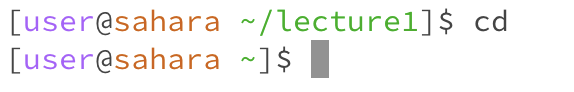
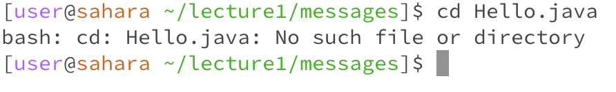
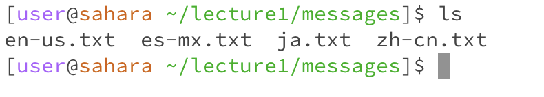
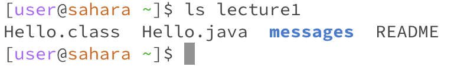
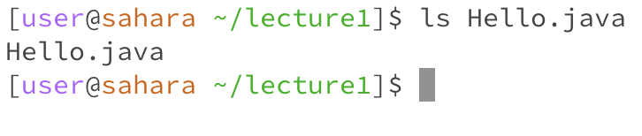
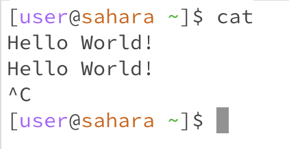
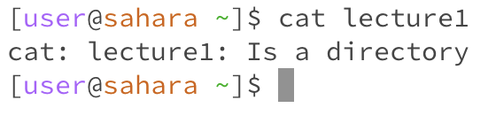
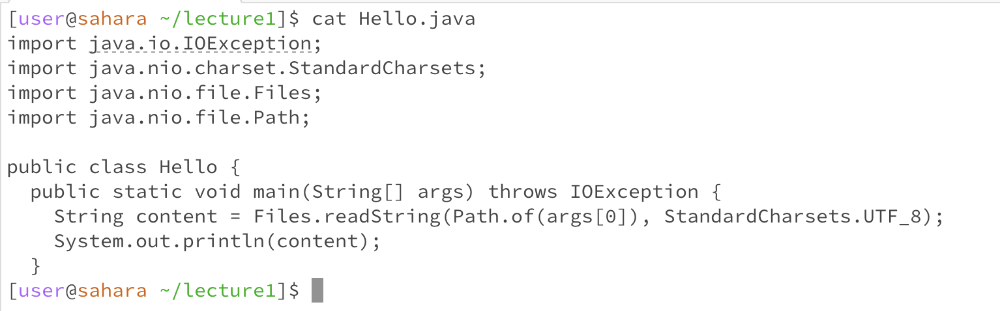

# Lab 1

## `cd` Command (Change Directory)

The change directory command is used to navigate through the directories in the file system using the terminal.

1) **No Arguments**
   
.

* **Working Directory** : `/home/lecture1/`
* **Function/OutPut** Utilizing the command without a file or directory arguement changes the working directory to the home directory of the user, but produces no output.
* **Error** No Error

2) **Directory Arguments**
   

* **Working Directory** : `/home/`
* **Function/OutPut** : Utilizing the command with a directory arguement changes the working directory changes to the directory that the user input in this case from `/home` to `/home/lecture1`, but produces no output.
* **Error** : No Error

3) **File Path Arguments**
   

* **Working Directory** : `/home/lecture1/messages`
* **Function/OutPut** : Utilizing the command with a file arguement produces `bash: cd: Hello.java: Not a directory` and does not do anything with this file. 
* **Error** : The command throws an error `bash: cd: Hello.java: Not a directory` because it only functions with directories.

## `ls` Command (List Directory Contents)

The list directory contents command is used to display the contents of the directory in terminal. 

1) **No Arguments**
   
 

* **Working Directory** : `/home/lecture1/messages`
* **Function/OutPut** : Utilizing the command without a file or directory arguement produces `en-us.txt es-mx.txt ja.txt zh-cn.txt`. The output is the names of the files in the current working directory. 
* **Error** : No Error.

2) **Directory Arguments**
   
 

* **Working Directory** : `/home/`
* **Function/OutPut** : Utilizing the command with a directory arguement produces `Hello.class Hello.java messages README`. The output is the names of the files in the inputted working directory. The messages is bolded because it is a directory.  
* **Error** : No Error.

3) **File Path Argument**
   
 

* **Working Directory** : `/home/`
* **Function/OutPut** : Utilizing the command with a file arguement produces `Hello.java`. The output is the name of the file input as the arguement.  
* **Error** : No Error.

## `cat` Command (Concatenate and Display File Content)

The concatenates and display file contents command is used to display the contents of the file in terminal. 

1) **No Arguments**
   
 

* **Working Directory** : `/home/`
* **Function/OutPut** : Utilizing the command without a directory or file arguement causes the terminal to repeat the user's input after the command has run. To exit this function, the user must input `CTRL+C`. 
* **Error** : The terminal functions like this because it is not how the cat command is intended to be used.
  
2) **Directory Arguments**
   
 

* **Working Directory** : `/home/`
* **Function/OutPut** : Utilizing the command with a directory arguement produces `cat: lecture1: Is a directory`. 
* **Error** : The output `cat: lecture1: Is a directory` is an error because the command is a directory but the command is intended to be used on a file.

3) **File Path Arguments**
   
 

* **Working Directory** : `/home/lecture1/`
* **Function/OutPut** : Utilizing the command with a file arguement produces
`import java.io. IOException;
import java.nio.charset.StandardCharsets;
import java.nio.file.Files;
import java.nio.file.Path;
public class Hello {
public static void main (String[] args) throws IOException {
String content = Files.readString(Path.of(args [0]), StandardCharsets.UTF_8);
System.out.printin(content);
}`. The command reproduces the code in the file that the user input in the terminal which is `Hello.java`.
* **Error** : No Error.
