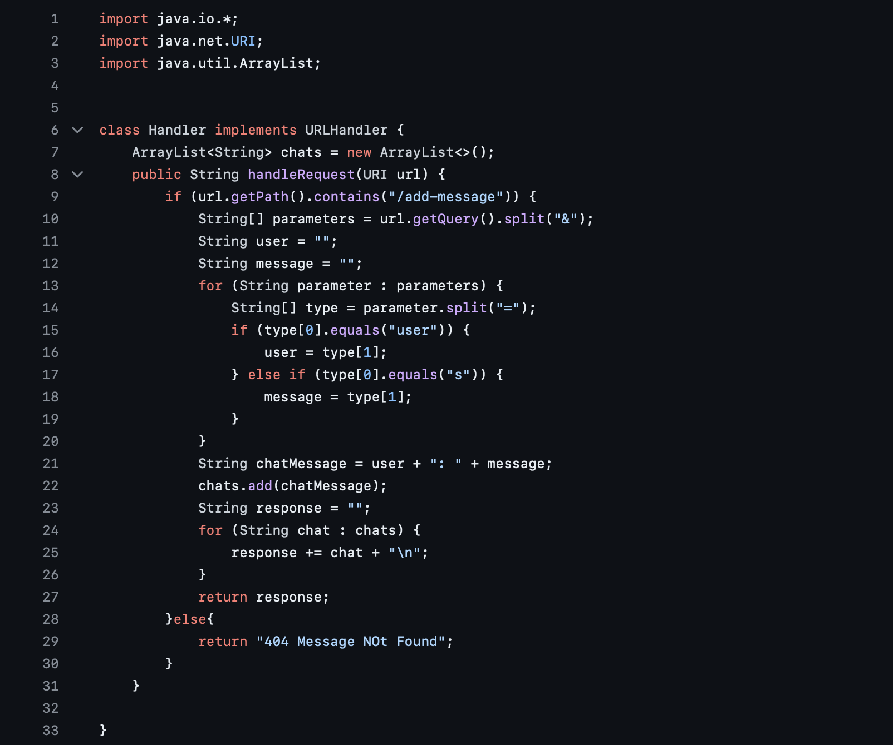
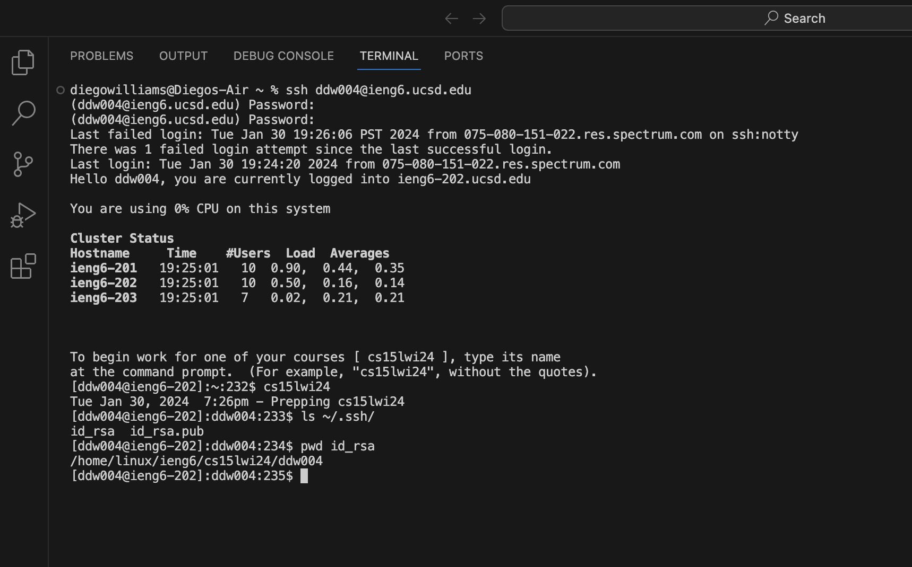
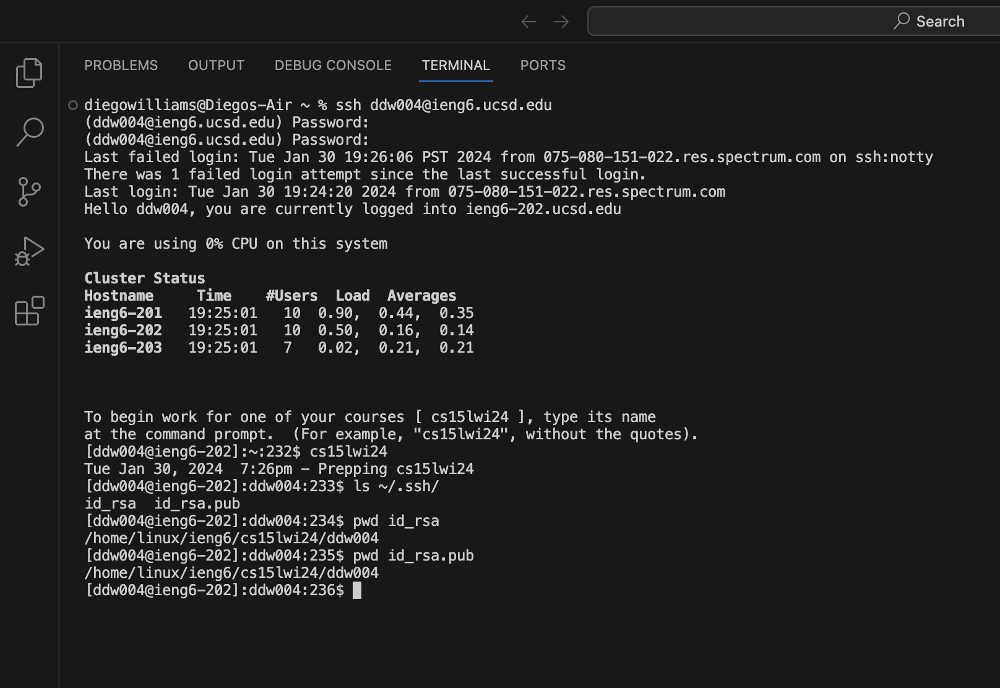
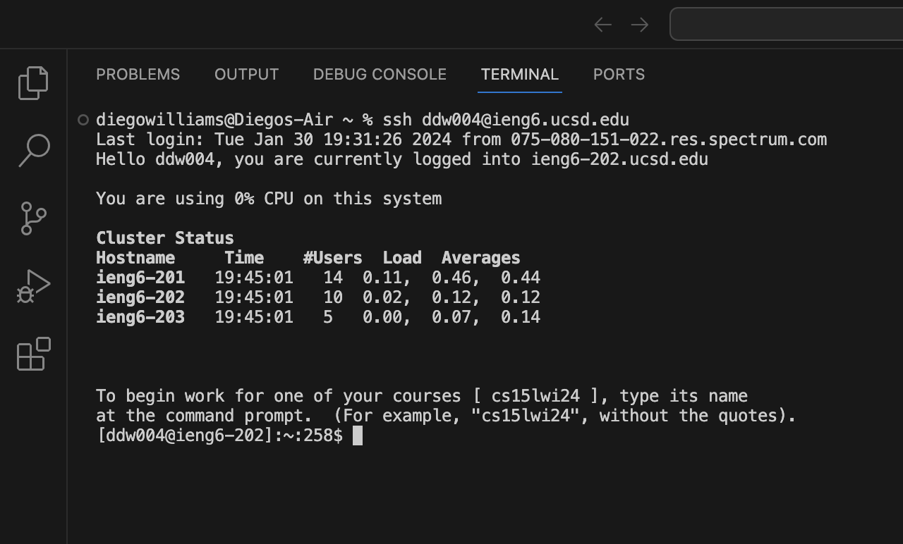

# `ChatServer.java` Code:

# `ChatServer.java` Attempt 1:

# `ChatServer.java` Attempt 2:

# Methods Called:
- In the screenshots, the method called is `handleRequest` in the `Handler` class which interpretes and acts on the `URI` request.
- The method is called when a request is made to the server with the path `/add-message`.

# Relevant Arguments and Field Values:

**For the request `/add-message?s=Hello&user=Diego`:**

- **Relevant Arguments:** `URI` object with path `/add-message` and query `s=Hello&user=Diego`.
- **Relevant Field Values:**
  - `chats`: Initialized as an empty `ArrayList` that takes in the history of chats.
  - `parameters`: Empty String `array` that differentiates the `message` and `user` queries.
  - `type`: Initialized as empty String `array` used to differentiate between user input and message input.
  - `user`: Initialized as an empty `string` that takes the input in the user field. 
  - `message`: Initialized as an empty `string` that takes the input in the message field.
  - `chatMessage`: Initialized as an empty `string` with the concatenated user input and message input in the form  `user + "; " message`.
  - `response`: Initialized as an empty `string` that allows the `chats` to be printed in new lines.
- **Changes in Field Values:**
  - `chats`: Changes from empty to containing one element: "Diego: Hello".
  - `parameters`: Changes from empty to containing 2 elements: "s=Hello" and "user=Diego".
  - `type`: The type is initialized in the iteration of `parameters` so it creates 2 distinct instances that turn from empty to containing 2 elements. The first version contains: "s" and "Hello". The second contains: "user" and "Diego". 
  - `user`: Changes from empty to containing the `string`: "Diego". 
  - `message`: Changes from empty to containing the `string`: "Hello".
  - `chatMessage`: Changes from empty to containing the `string`: "Diego: Hello".
  - `response`: Changes from empty to containing the `string` --"Diego: Hello"-- followed by the movement to the next line.

**For the request `/add-message?s=World&user=Diego`:**

- **Relevant Arguments:** `URI` object with path `/add-message` and query `s=world&user=Diego`.
- **Relevant Field Values:**
  - `chats`: Contains one element: "Diego: Hello".
  - `parameters`: Empty String `array` that differentiates the `message` and `user` queries.
  - `type`: Initialized as empty String `array` used to differentiate between user input and message input.
  - `user`: Initialized as an empty `string` that takes the input in the user field. 
  - `message`: Initialized as an empty `string` that takes the input in the message field.
  - `chatMessage`: Initialized as an empty `string` with the concatenated user input and message input in the form  `user + "; " message`.
  - `response`: Initialized as an empty `string` that allows the `chats` to be printed in new lines.
- **Changes in Field Values:**
  - `chats`: Changes from empty to containing two elements: "Diego: Hello" and "Diego: World".
  - `parameters`: Changes from empty to containing 2 elements: "s=World" and "user=Diego".
  - `type`: The type is initialized in the iteration of `parameters` so it creates 2 distinct instances that turn from empty to containing 2 elements. The first instance contains: "s" and "World". The second contains: "user" and "Diego". 
  - `user`: Changes from empty to containing the `string`: "Diego". 
  - `message`: Changes from empty to containing the `string`: "World".
  - `chatMessage`: Changes from empty to containing the `string`: "Diego: World".
  - `response`: The type is initialized in the iteration of `chats` so it creates 2 distinct instances that turn from empty to containing 1 element. The first instance contains: "Diego: Hello". The second conatins: "Diego: World."

# Explanation of Field Changes:
  - `chats`: Changes with each request because the method `handleRequest` adds a new chat messages to this list based on the incoming requests unless the `URI` request or path is invalid.
  - `parameters`: Changes when the query is split according to the position of "&".
  - `type`: Instance variable that takes the values of `parameters` split by "=".
  - `user`: Changes to the second value of `type`, if the first value of `type` is "user". 
  - `message`: Changes to the second value of `type`, if the first value of `type` is "s".
  - `chatMessage`: Concatenates `user` + ": " + `message`.
  - `response`: Instance variable that takes the values of `chats` and creates a new line after.

# Path to Private Key

# Path to Public Key

# No Password Entry

