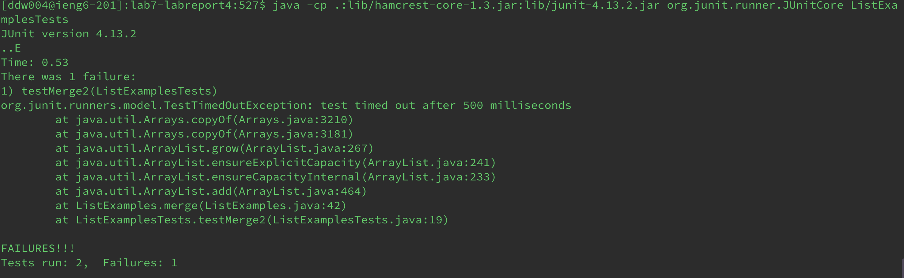
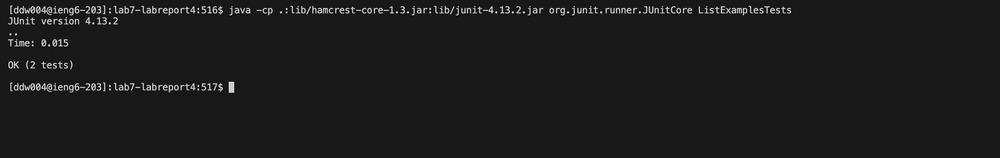
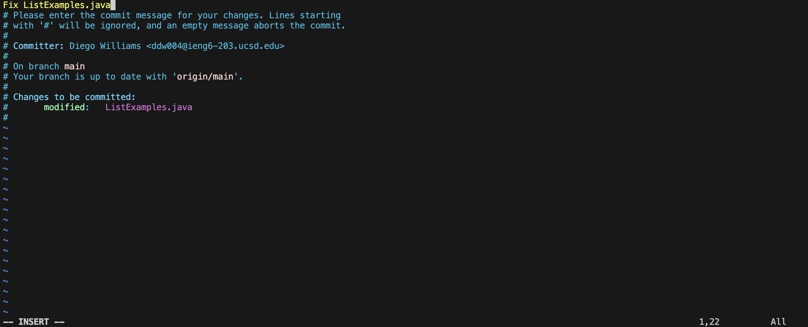
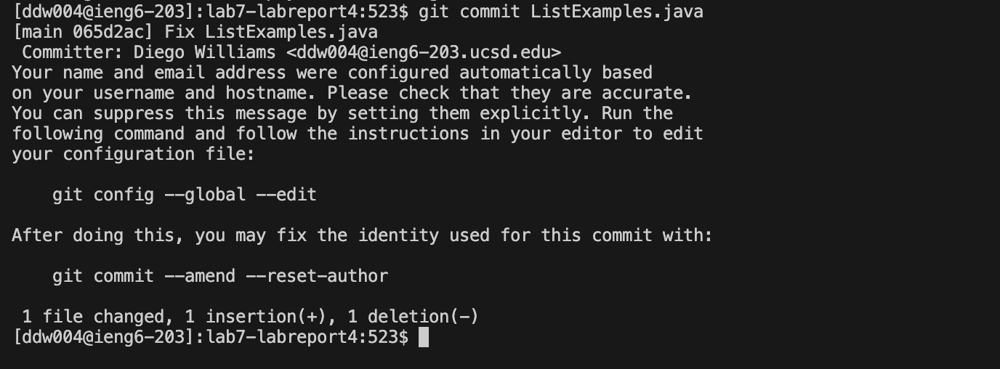
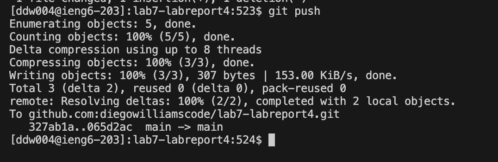

# Lab 4
## SSH

**Keys Pressed:** `ssh ddw004@ieng6.ucsd.edu`
- First, I logged into my `ieng6` acoount using the command `ssh ddw004@ieng6.ucsd.edu` on my personal computer that has my account keys saved already.
  
**Keys Pressed:** `git clone git@github.com:diegowilliamscode/lab7-labreport4.git`
- To download the repository from GitHub, I entered the command `git clone git@github.com:diegowilliamscode/lab7-labreport4.git`.

## Test Run
**Keys Pressed:** `cd lab7-labreport4`
- I utilized the `cd lab7-labreport4<enter>` command to change my current directory to `/home/linux/ieng6/cs15lwi24/ddw004/lab7-labreport4`.
  
**Keys Pressed:** `CMD + C`, `CMD + V`, and `<enter>`
- Then I copied and pasted the commands `javac -cp .:lib/hamcrest-core-1.3.jar:lib/junit-4.13.2.jar *.java` to compile all the java files in the current directory.
  
**Keys Pressed:** `CMD + C`, `CMD + V`, and `L<tab>T<tab><enter>`
- I proceeded to copy and paste the command to run the tests, but I needed to add the desired file `ListExamplesTests.java`. I pressed `L<tab>` but that only autocompleted to `ListExamples`, so by pressing `T<tab>` it correctly autocompleted to `java -cp .:lib/hamcrest-core-1.3.jar:lib/junit-4.13.2.jar org.junit.runner.JUnitCore ListExamplesTests`. After pressing `<enter>`, I was able to see that one test passed and the other failed.
  

(Used Edstem because ieng6 would not compile
)
## Fixing the Error in Vim

### The Error

### The Fix
**Keys Pressed:** `vim L<tab>.<tab>`
- To find the error, I used the `vim` command to open a the file and edit it. I pressed `L<tab>` so that it would autocomplete; however, it did not autocomplete to `ListExamples.java` only`ListExamples` so I pressed `.<tab>` so that it would fully complete.

**Keys Pressed:** `44G`
- I used `44G` to go to the start of the 44th line which was where the error was. It was not dificult to find this line because it was near the bottom and my terminal informed me that there are 50 lines.
  
**Keys Pressed:** `e`
- This command brought me the end of the first word in the line which was where the "1" in `index1` had to be changed to a "2".
  
**Keys Pressed:** `r`
- This command allowed me to replace the singular character under the cursor which was "1".
  
**Keys Pressed:** `2`
- The "2" was the data that was needed to replace `index1` with `index2`.
  
**Keys Pressed:** `:wq`
- These keys save the changes made and exit the Vim editor.
  
### Checking

**Keys Pressed:** `<up><up><enter>`
- Since the compiling code `javac -cp .:lib/hamcrest-core-1.3.jar:lib/junit-4.13.2.jar *.java` was already in my history, I moved up twice to find it.
  
**Keys Pressed:** `<up><up><enter>`
- I did the same thing to retrieve the code to run the tests `java -cp .:lib/hamcrest-core-1.3.jar:lib/junit-4.13.2.jar org.junit.runner.JUnitCore ListExamplesTests`.
  

## Git Commands

**Keys Pressed:** `git com<tab> L<tab>`
- These keys input the command `git commit` using the `<tab>` for autocomplete of `commit` and `ListExamples.java`. The command allows the user to write a commit message for the changes.

**Keys Pressed:** `a`
- This command allows me to insert text into the commit.
  
**Keys Pressed:** `Fix ListExamples.java`
- I used this as the commit message.
  

**Keys Pressed:** `git push`
- I could have used `git push origin main` but I found this worked and used less characters. This command pushes the changes out to the repository.
  

