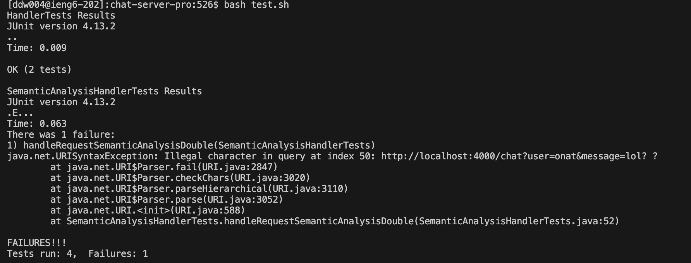
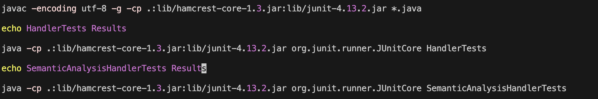
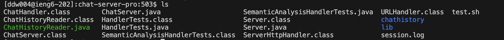
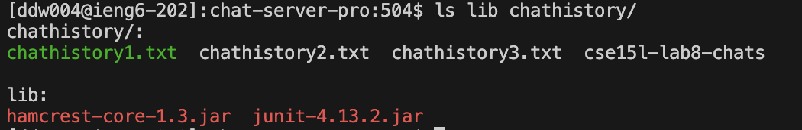
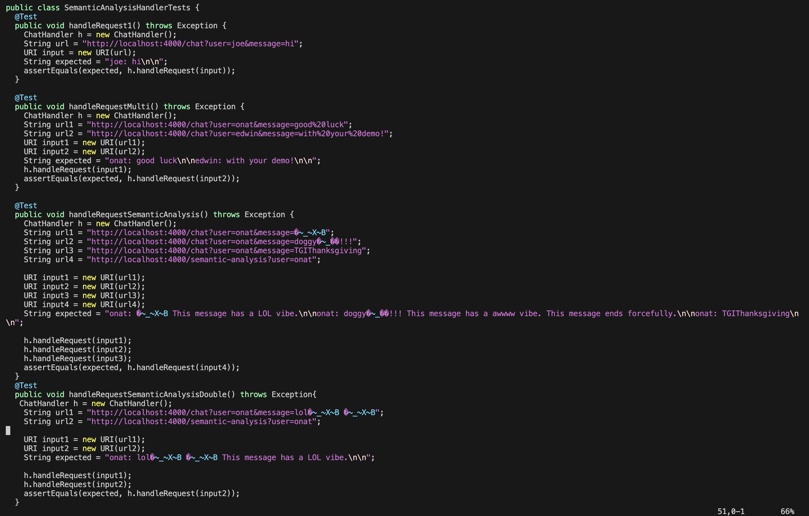
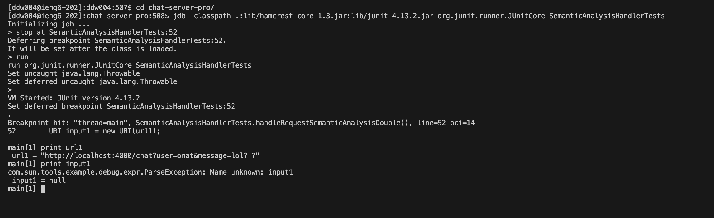
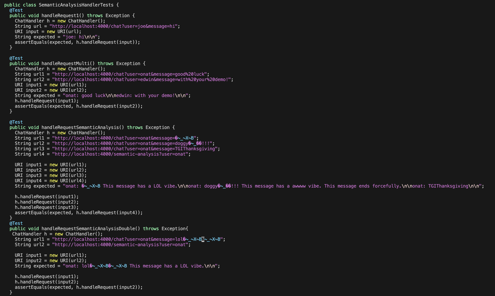

# Lab 5
## Student and Tutor
### Student:
Hello, I have ran into an unfamiliar error. I have modified my `ChatServer.java` but I do not understand the error message especially since my code is psassing the other tests.

**These are my test results:**


**This is the bash script I ran:** 
`test.sh`


**These images show my file organization:** 



**This is my tester:** 
`SemanticAnalysisTests.java`


**This is my ChatServer.java (Would have taken 3 images so I copied and pasted):**
`ChatServer.java`
```
import java.io.IOException;
import java.net.URI;
import java.io.BufferedWriter;
import java.io.File;
import java.io.FileWriter;

class ChatHandler implements URLHandler {
  String chatHistory = "";

  public String handleRequest(URI url) {

    // expect /chat?user=<name>&message=<string>
    if (url.getPath().equals("/chat")) {
      String[] params = url.getQuery().split("&");
      String[] shouldBeUser = params[0].split("=");
      String[] shouldBeMessage = params[1].split("=");
      if (shouldBeUser[0].equals("user") && shouldBeMessage[0].equals("message")) {
        String user = shouldBeUser[1];
        String message = shouldBeMessage[1];
        this.chatHistory += user + ": " + message + "\n\n";
        return this.chatHistory;
      } else {
        return "Invalid parameters: " + String.join("&", params);
      }
    }
    else if (url.getPath().equals("/")){
      return this.chatHistory;
    }
    // expect /retrieve-history?file=<name>
    else if (url.getPath().equals("/retrieve-history")) {
      String[] params = url.getQuery().split("&");
      String[] shouldBeFile = params[0].split("=");
      if (shouldBeFile[0].equals("file")) {
        String fileName = shouldBeFile[1];
        ChatHistoryReader reader = new ChatHistoryReader();
        try {
          String[] contents = reader.readFileAsArray("chathistory/" + fileName);
          for (String line : contents) {
            this.chatHistory += line + "\n\n";
          }
        } catch (IOException e) {
          System.err.println("Error reading file: " + e.getMessage());
        }
      }
      return this.chatHistory;
    }
    // expect /save?name=<name>
    else if (url.getPath().equals("/save")) {
      String[] params = url.getQuery().split("&");
      String[] shouldBeFileName = params[0].split("=");
      if (shouldBeFileName[0].equals("name")) {
        File directory = new File("chathistory");
        File file = new File(directory, shouldBeFileName[1]);

        try (BufferedWriter writer = new BufferedWriter(new FileWriter(file))) {
          writer.write(this.chatHistory);
          return "Data written to " + shouldBeFileName[1] + "in 'chat-history' folder.";
        } catch (IOException e) {
          e.printStackTrace();
          return "Error: Something wrong happen during file save, check StackTrace";
        }
      }
    }
    // expect /semantic-analysis?user=<name>
    else if (url.getPath().equals("/semantic-analysis")) {
      String[] params = url.getQuery().split("&");
      String[] shouldBeUser = params[0].split("=");
      String matchingMessages = "";
      if (shouldBeUser[0].equals("user")) {
        String[] chatHistoryArr = this.chatHistory.split("\n\n");
        int index = 0;
        while (index < chatHistoryArr.length) {
          String line = chatHistoryArr[index];
          int numberOfExclamationMarks = 0;
          String analysis = "";
          index += 1;
          int[] codePoints = new int[0];
          if (line.contains(shouldBeUser[1]))
            codePoints = line.codePoints().toArray();
            int characterIndex = 0;
            while (characterIndex < codePoints.length) {
              int character = codePoints[characterIndex];
              if (character == (int) '!') {
                numberOfExclamationMarks += 1;
              }
              if (new String(Character.toChars(character)).equals("😂")) {
                analysis = " This message has a LOL vibe.";
              }
              if (new String(Character.toChars(character)).equals("🥹")) {
                analysis = " This message has a awwww vibe.";
              } else {
              characterIndex += 1;
               }
            }
            if (numberOfExclamationMarks > 2) {
              analysis += " This message ends forcefully.";
            }
            matchingMessages += line + analysis + "\n\n";
          }
        }
      
      return matchingMessages;
    }
    return this.chatHistory;
  }
}

class ChatServer {
  public static void main(String[] args) throws IOException {
    int port = Integer.parseInt(args[0]);
    Server.start(port, new ChatHandler());
  }
}
```
### Tutor:
No problem. Good job sending all the files necessary for debugging. This does look complicated. First, make sure `chat-server-pro` is the working directory. Then, enter jdb using `jdb -classpath .:lib/hamcrest-core-1.3.jar:lib/junit-4.13.2.jar org.junit.runner.JUnitCore SemanticAnalysisHandlerTests`. Once you are in jbd mode, stop at line 52 since the error seems to occur on that line. Do this by entering `stop at SemanticAnalysisHandlerTests:52`. Then run the tester simply by entering `run`. After the jdb stops at the breakpoint can you enter `print url1` and then, `print input1`. Let me know what this returns to help you solve this bug. 

### Student: 
Okay. I did what you told me. Here is what the commands you told me to input returned. 


### Tutor:
I think I know what your problem is. Try entering vim using `vim SemanaticAnalysisHandlerTests.java` and deleting the space between your emojis (using `x`). Make sure to save this using `:wq`, then run the tests again with `bash test.sh` to see what happens.

### Student:
Okay, will do. How do I leave jdb mode though?

### Tutor:
Enter `quit`.

### Student 
Like this?


### Tutor
Exactly.

### Student:
Let's go! It worked. What was the problem?


### Tutor:
The issue you're encountering with spaces between emojis when handling requests relates to how URIs are structured and encoded. URIs use encoding to handle special characters, including spaces. Spaces in a URI are typically encoded as %20 in query parameters. This means that if a message contains an encoded space between emojis, it will not be correctly split or decoded when directly handled by your code.

## Reflection
