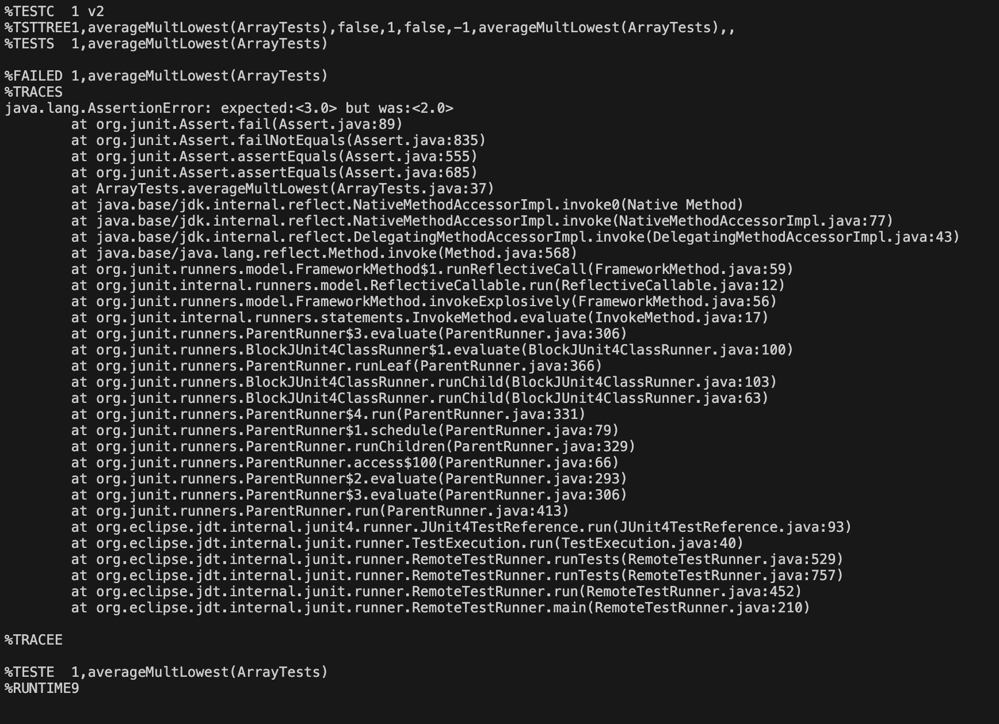

# Lab 3
## Bugs
### Failure Inducing Input:
```
@Test
  public void averageMultLowest() {
    double[] input1 = {0.0, 1.0, 2.0, 3.0, 0.0, 6.0, 0.0};
    assertEquals(2.0, ArrayExamples.averageWithoutLowest(input1), 0.001);
  }
```

### Non-Failure Inducing Input:
```
@Test
    public void testAverageWithoutLowest_NoFailure() {
        double[] arr = {1.0, 2.0, 3.0, 6.0};
        assertEquals(2.0, averageWithoutLowest(arr), 0.001);
    }
```
### Symptom:


### The Buggy Code:
```
static double averageWithoutLowest(double[] arr) {
    if(arr.length < 2) { return 0.0; }
    double lowest = arr[0];
    for(double num: arr) {
      if(num < lowest) { lowest = num; }
    }
    double sum = 0;
    for(double num: arr) {
      if(num != lowest) { sum += num; }
    }
    return sum / (arr.length - 1);
  }
```

### Fixed Code:
```
static double averageWithoutLowest(double[] arr) {
    if(arr.length < 2) { 
    return 0.0; 
    }
    double lowest = arr[0];
    for(double num: arr) {
      if(num < lowest) {
      lowest = num; 
      }
    }
    int count = 0
    double sum = 0;
    for(double num: arr) {
      if(num != lowest) { 
      sum += num;
      count ++;
      }
    }
    return sum / count;
  }
```

In the corrected version, I added a count to keep track of the number of non-lowest numbers in the array (even if multiple are present). Instead of dividing by arr.length - 1, it divides by count to get the correct average.

## `Grep` Command

### `grep -n`

Displays the lines where the match is found and the number of those lines in their respective files, if called in more than one file. 
```
[ddw004@ieng6-201]:Media:438$ grep -n "9/11" Terrorist_Attack.txt
20:still making headlines, known as simply "9/11."
```

```
[ddw004@ieng6-201]:Media:440$ grep -n "El Paso" *
Entities_Merge.txt:16:stretches from El Paso to Corpus Christi, Harlingen to Austin.
Texas_Lawyer.txt:15:Austin south to the Rio Grande Valley and west to El Paso. The
man_on_national_team.txt:9:Chihuahuita home in South El Paso.
man_on_national_team.txt:53:El Paso, was one of the friends who pitched in for the trip.
man_on_national_team.txt:61:meeting, he wore the clothes all El Pasoans recognize him in: his
man_on_national_team.txt:78:At about the same time, El Paso gallery owner Adair Margo was
man_on_national_team.txt:79:involved in a Junior League of El Paso project that was documenting
man_on_national_team.txt:92:on their trips to El Paso.
```

### `grep -B n`

Prints the line where the search is found along with n lines before the result. The same principle applies if multiple instances of the search are found.

```
[ddw004@ieng6-201]:Media:432$ grep -B 2 "grants" Legal_hotline.txtThe hotline, which is part of Legal Services of Northern
California, was the only California application from 24 submitted
nationwide for $1.5 million in grants. "It was because of a
```

```
[ddw004@ieng6-201]:Media:463$ grep -B 1 "legal" Annual_Fee.txt
The Illinois Supreme Court on Friday hiked attorney registration
fees by $49 a year to boost both legal aid services and support for
--
Most of the latest increase -- $42 -- will go to the Lawyers
Trust Fund of Illinois, which disburses monies to legal aid
--
The Lawyers Trust Fund and LAP aim, respectively, to improve
legal services to the poor to provide equal justice under the law,
--
a commitment by the full court, and by attorneys in Illinois, to
assume responsibility for those unable to afford legal services and
--
director of the Lawyers Trust Fund.
As a result, funding available for the legal aid groups has
--
said Friday.
The Lawyers Trust Fund helps underwrite operations at 34 legal
--
for all attorneys in the state how important it is that lawyers be
made aware of their responsibilities to try to ensure legal
```

### `grep –i`

Prints lines where search is found ignoring upper and lower case differences from inputs. Specifies the file if seatrched for in multiple files.

```
[ddw004@ieng6-201]:Media:435$ grep -i "MedicAid" Anthem_Payout.txt
Poorest Policyholders could lose Medicaid, other Benefits
by losing their benefits under Medicaid, food-stamp and other
TO avoid losing valuable benefits such as a Medicaid-paid spot
elderly residents in Medicaid nursing-home beds.
To qualify for Medicaid and some other state-administered aid
Medicaid threshold is even lower, $1500.
spokeswoman Lauren Green-Caldwell. But after talking to Medicaid
eligibility policy for Kentucky Department for Medicaid Services.
spend the money on. Kentucky advocates and Medicaid officials
Otherwise, when you report spending to Medicaid - as is required -
```

```
[ddw004@ieng6-201]:Media:444$ grep -i "UniVersITY laW sChooL" *
Entities_Merge.txt:University Law School to involve students at the University of
Legal_system_fails_poor.txt:director of clinical programs at Rutgers University Law School in
```

### `grep -l`

Displays list of the filenames where the search is found

```
[ddw004@ieng6-201]:Media:433$ grep -l "findings" *
Farm_workers.txt
Legal_system_fails_poor.txt
Low-income_children.txt
Survey.txt
Terrorist_Attack.txt
```

```
[ddw004@ieng6-201]:Media:431$ grep -l "University" *
Assuring_Underprivileged.txt
Attorney_gives_his_time.txt
Avoids_Budget_Cut.txt
Barnes_Volunteers.txt
Barnes_new_job.txt
Boone_legal_service.txt
Bridging_legal_aid_gap.txt
CommercialAppealMemphis2.txt
Donald_Hilliker.txt
Entities_Merge.txt
Ginny_Kilgore.txt
Good_guys_reward.txt
GreensburgDailyNews.txt
Helping_Hands.txt
Kiosks_for_court_forms.txt
Law-school_grads.txt
Law_Award_from_College.txt
Law_Schools.txt
Legal-aid_chief.txt
Legal_Aid_attorney.txt
Legal_system_fails_poor.txt
Lindsays_legacy.txt
Low-income_children.txt
Major_Changes.txt
Marylands_Legal_Aid.txt
Poverty_Lawyers.txt
Raising_the_Bar.txt
Survey.txt
Terrorist_Attack.txt
Texas_Lawyer.txt
Texas_Supreme_Court.txt
Valley_Needing_Legal_Services.txt
Wilmington_lawyer.txt
```
Sources: [Geeks for Geeks: Grep](https://www.geeksforgeeks.org/grep-command-in-unixlinux/)
